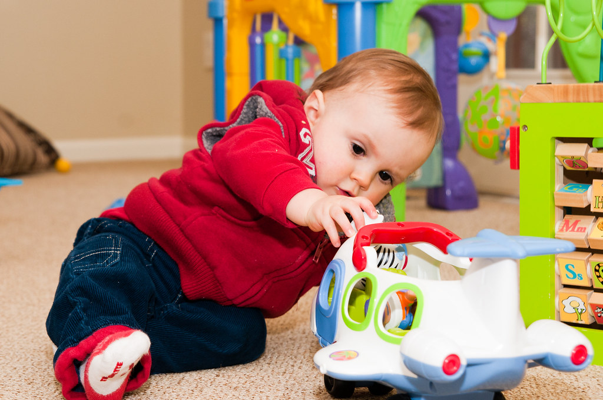

*This is probably going to be a little, personal thing I'll update once a week.* [^1]

[^1]: We shall see about that...

**Everyone in academia** needs to read hundreds of papers and, let's be honest, many are difficult to get through. So we usually are told early on, that the abstract is the most important part to see whether you should spend the actual time and concentration on reading the paper. This is, of course, assuming you actually read whole papers and not just the abstract or - even worse - indirectly reference them from how others did.

Anyway, I have **several folders** on my computer in which I store papers I have already read and I still want/need to read. Similarly, there are text documents to keep some notes with similar objectives. The notes are only for myself to remember what each paper was about and might also include potential comments, questions, or inspirations I had.

### But why a blog?
Then this workshop came along where I could program my own first blog and I am not someone who posts personal stories. Thus, I was in a bit of a pickle, as I had no clue what to make the blog about! And I don't have enough humor, to make it about something silly and un-useful. 

**Here my pitch**: I will simply upload some summarizing and, if I'm courageous enough, commentary notes to the papers I read. The papers will be primarily about infant and children research, as I have been focused on developmental psychology ever since my bachelor days and will start my Ph.D. in the curiosity project at [Lancaster Univerity's Babylab](http://wp.lancs.ac.uk/babylab/) this October. 

So maybe you're a student who looked for one of the by then uploaded papers, maybe you are a parent who wants to learn more about your child but you do not have access to or the nerve to read the actual papers. Then I hope, this blog will indeed have a purpose and help you - I have to say, that would be lovely!

Mhm...this has been much longer than I planned or expected...
Anyway, enjoy!
(even if I might be the only one ever reading these posts^^) 

Best wishes,  
Elena

